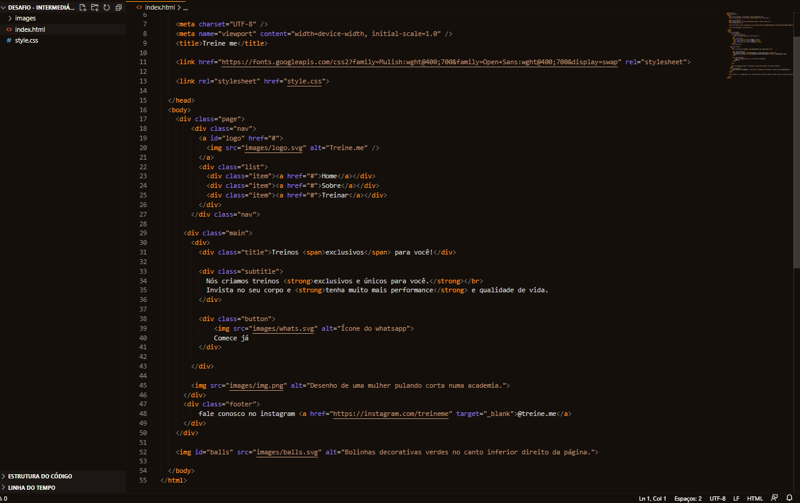

# Treino de acessibilidade e semântica do Explorer  

> Nível 2 do Explorer

Desafio do nível 2 do curso Explorer da Rocketseat, onde o projeto (02) inicial estava com códigos desorganizados e quebrados em divs com classes dos nomes que deveriam ser utilizados.

[🔗 Clique aqui para visualizar o projeto com a resolução](https://loren175.github.io/Acessibilidade)

## 🚀 Tecnologias

- HTML
- CSS
- Git e Github

## 📞 Contato

>rafael.loren175@gmail.com

## 👾 Discord

>rafas#762